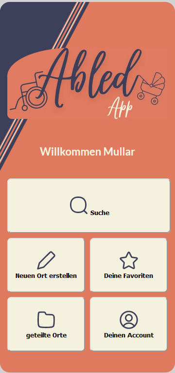
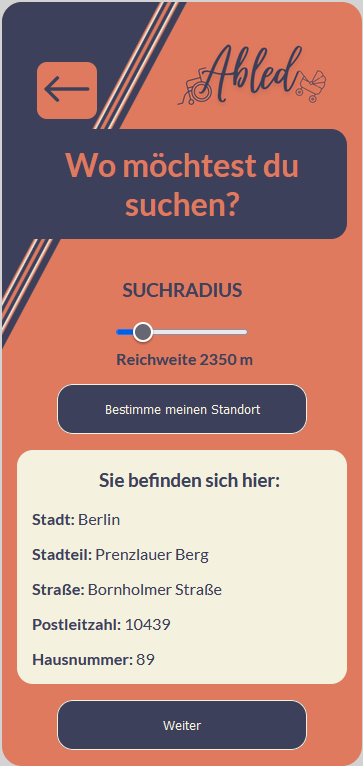
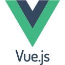

# Moin! I´m Max 👋

### CODING = FUN 🌋                        
                                               
### CODING = CHALLENGING 🤺                   
                                               
### CODING = FUTURE 🛸                     
    
### CODING = FREEDOM 🐳
    
### CODING = CONNECTION ⚗️
    
### CODING != JUST A JOB ♟️

## the first version of our accessibility app (Abled) is ready. 
* <a href="https://abledapp.netlify.app/">here you can try out the published app</a>
*  <a href="https://github.com/coding-bootcamps-eu/final-project-2024-01-accessibility">Link to the repository </a>  
(The app is still under development and is constantly being expanded )  

 
  

## I am currently studying:

  
  
  
  
   
  
  
  

  

