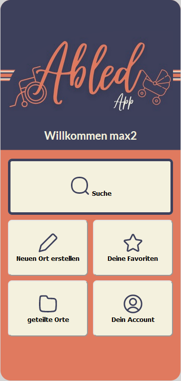
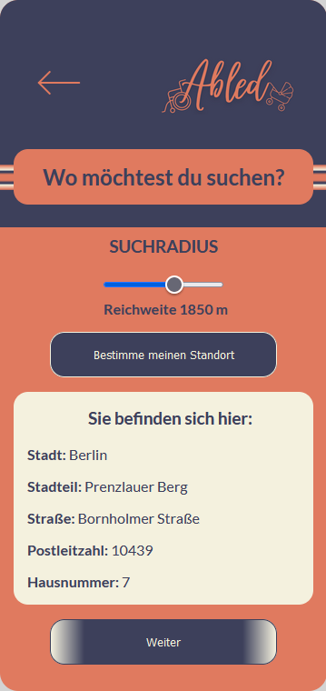
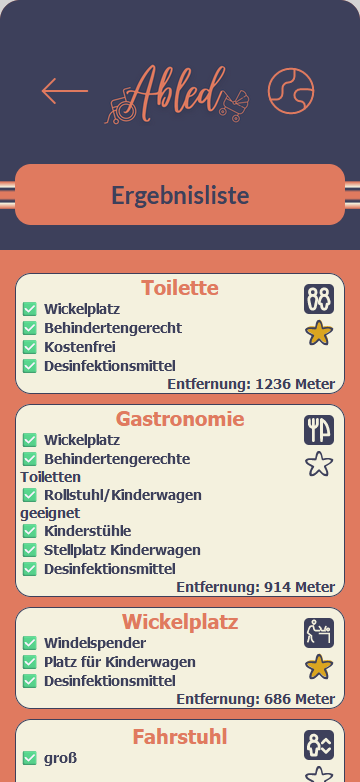
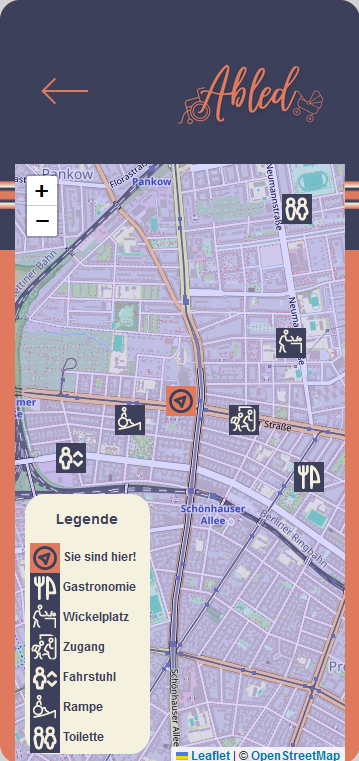
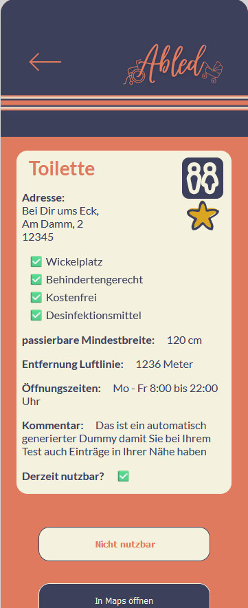
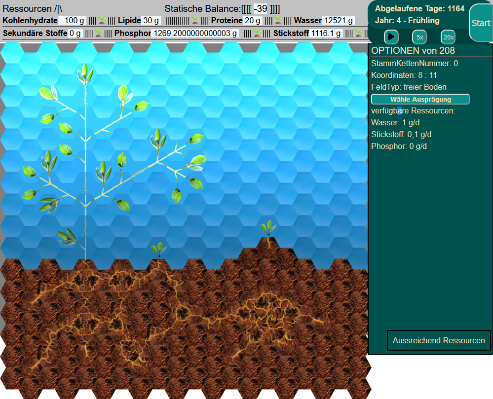

# Moin! I´m Max 👋

### CODING = FUN 🌋                        
                                               
### CODING = CHALLENGING 🤺                   
                                               
### CODING = FUTURE 🛸                     
    
### CODING = FREEDOM 🐳
    
### CODING = CONNECTION ⚗️
    
### CODING != JUST A JOB ♟️

## the currently version of our accessibility app (Abled) is ready. 
* <a href="https://abledapp.netlify.app/">here you can try out the published app</a>
*  <a href="https://github.com/mullerow/Abled-App">Link to the repository </a>  

 
  
  
  
  
 

<h3>PLANTAS GAME</h3>
  
  

To further develop my vue.js skills and to deal with complex amounts of data i am developing the game PLANTAS. The aim is to create a kind of plant simulation. The focus is on the struggle for survival against many factors such as light, water, phosphorus, cold, heat, predators and parasites. On the map, competing plants will fight against you for the best places in the sun and also force you underground to grow your roots wisely. The aim will usually be to develop the plant to the point where it produces flowers and eventually seeds. As soon as the survival of the species is ensured by new shoots, the game is won.
  

 

  

<h3>I am currently studying:</h3>

  
  
  
  
   
  
  
   

  

